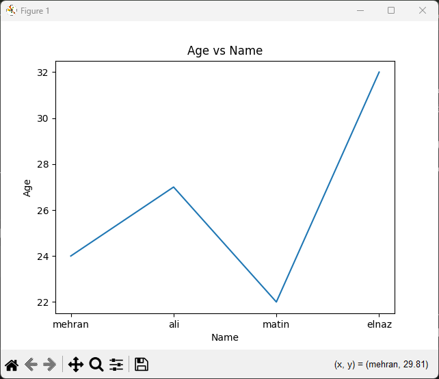

### Sample script:
Assume that you have installed or have the PyInsight library available locally. Run the following script to see the output:

#### `test.py`
```python
from pyinsight.interactive import InteractiveTable, InteractivePlot
from pyinsight.text_analysis import TextAnalysis
from pyinsight.live_data import LiveDataPlot
import pandas as pd

# Sample data for interactive table
data = pd.DataFrame({
  "Name": ["mehran", "ali", "matin", "elnaz"],
  "Age": [24, 27, 22, 32],
  "City": ["tehran", "gilan", "boshehr", "karaj"]
})

# Show interactive table
table = InteractiveTable(data)
table.show()

# Filter data by city
filtered_table = table.filter("City", "karaj")
filtered_table.show()

# Draw an interactive diagram
plot = InteractivePlot(data, "Name", "Age")
plot.show()

# Text analysis
text = "Python is a great programming language. It is widely used in data science."
analysis = TextAnalysis(text)
print("Sentiment:", analysis.sentiment())
print("Keywords:", analysis.keywords())

# Display live data
live_plot = LiveDataPlot(update_interval=2)
live_plot.start()
```

### Sample output:

#### 1. **Display the table in the console:**
```
 Name Age City
0  mehran   24   tehran
1     ali   27    gilan
2   matin   22  boshehr
3   elnaz   32    karaj
```



#### 2. **Filter the table to show only "Chicago":**
```
 Name Age City
2 elnaz 22 karaj
```

#### 3. **Display the graph (in the form of a simple line graph):**

This part of the script draws a line graph where people's age (`Age') is on the `Y' axis and their name (`Name') is on the ``X'' axis. The plot is displayed as a pop-up window in matplotlib.

#### 4. **text analysis:**
```
Sentiment: Sentiment (polarity=0.8, subjectivity=0.75)
Keywords: ['python', 'great programming language', 'data science']
```

#### 5. **Live Data:**
```
Starting live data feed...
New data: 43
New data: 58
New data: 79
...
```
In this section, random data is continuously generated and displayed to resemble real live data. To stop the data flow, you can use `Ctrl+C'.
